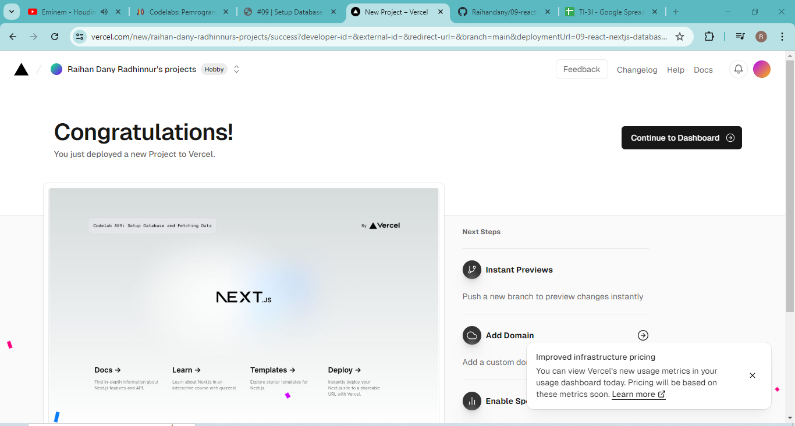
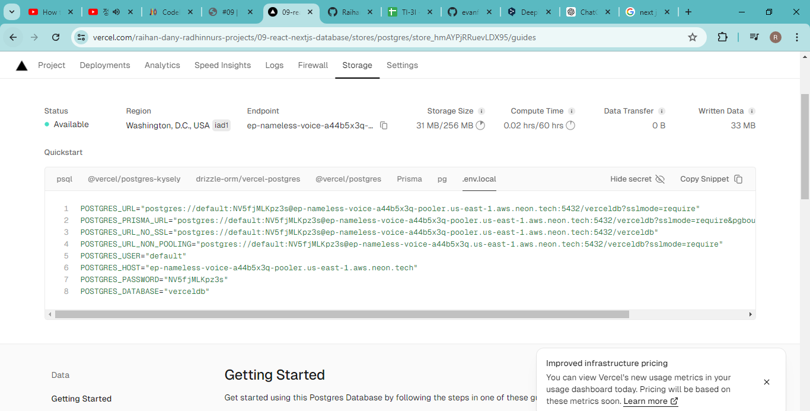
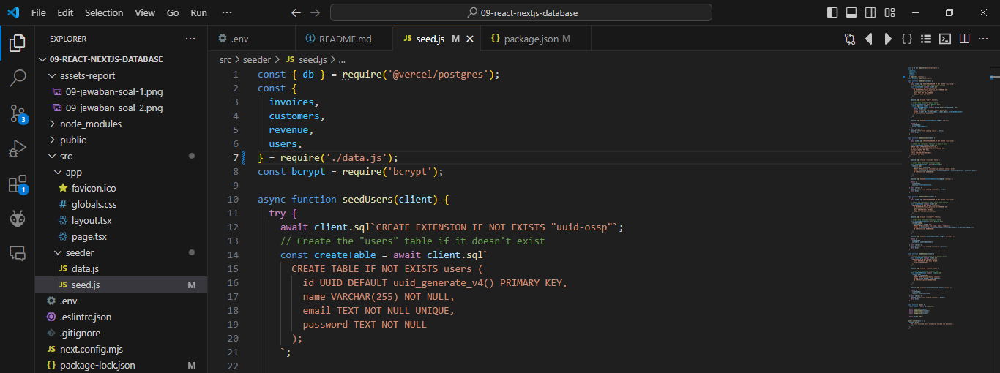

## Laporan Praktikum

|  | Pemrograman Berbasis Framework 2024 |
|--|--|
| NIM |  2141720166|
| Nama |  Raihan Dany Radhinnur |
| Kelas | TI - 3I |

### Practicum 1  

## Soal 1
"Capture hasil deploy project Anda dan buatlah laporan di file README.md. Jelaskan apa yang telah Anda pelajari Jangan lupa push dengan pesan commit: "W09: Jawaban soal 1". "

    We can use or implement Vercel to create web-based applications. It can be easily connected with NextJS framework in React programming language and other frameworks, producing with fast speed and high reliability in its infrastructure. By being able to connect with Repositories on GitHub that are owned, with only 1 time configuration easily and instantly without the need to configure each push repository.

 

## Soal 2
"Capture hasil basis data Anda dan buatlah laporan di file README.md. Jelaskan apa yang telah Anda pelajari Jangan lupa push dengan pesan commit: "W09: Jawaban soal 2". "

    We can create a database online in Vercel, in this practicum experiment we use Postgress which is a serverless SQL. In this practicum we need to connect/create .env in our root framework project, which has a private configuration code that can be seen in Vercel after completing Create Postgress Database in the store tabs section. We also need to verify that the .gitignore list includes .env so that it is not exposed when pushing the repository to our Github.

 

## Soal 3
"Capture hasil npm run seed Anda dan buatlah laporan di file README.md. Jelaskan apa yang telah Anda pelajari ?
Jangan lupa push dengan pesan commit: "W09: Jawaban soal 3". "

 

    We can do the npm run seed command to seed our data to the database, we need to configure in package.json by adding the code "seed": "node -r dotenv/config ./src/seeder/seed.js" in the bait scripts.
    Need to do the command npm i --save dotenv and npm i --save bcrypt first to overcome / prevent dotenv module errors and bcrypt module errors.
    After that, change the code in seed.js by changing the code to require( ./data.js ) if there is a Cannot find module 'data.js' error.

 